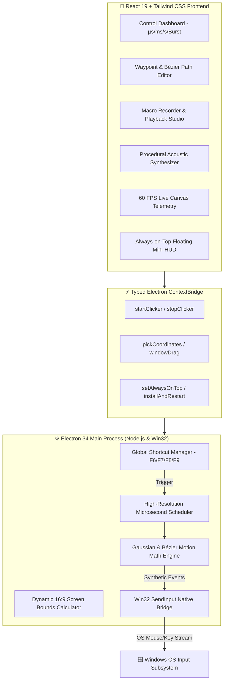

# ⚡ HyperClick Pro 2026

<div align="center">

```
   __  __                         ____ _ _      _      ____             ____   ___ ____   __   
  / / / /_  ______  ___  _____   / ___| (_) ___| | __ |  _ \ _ __ ___  |___ \ / _ \___ \ / /_  
 / /_/ / / / / __ \/ _ \/ ___/  | |   | | |/ __| |/ / | |_) | '__/ _ \   __) | | | |__) | '_ \ 
/ __  / /_/ / /_/ /  __/ /      | |___| | | (__|   <  |  __/| | | (_) | / __/| |_| / __/| (_) |
\/ /_/ \__, / .___/\___/_/       \____|_|_|\___|_|\_\ |_|   |_|  \___/ |_____|\___/_____|\___/ 
      /____/_/                                                                                  
```

**Next-Generation Ultra-Fast Desktop Automation & Accessibility Workstation for Windows 10 & 11**

[](https://github.com/Laknicek/hyperclick-pro)
[](LICENSE)
[-4facfe?style=for-the-badge&logo=windows&logoColor=white)](https://github.com/Laknicek/hyperclick-pro/releases)
[](https://github.com/Laknicek/hyperclick-pro)
[](https://github.com/Laknicek/hyperclick-pro)
[](https://github.com/Laknicek/hyperclick-pro)

[Overview](#-overview) •
[Key Features](#-key-features) •
[Architecture](#-system-architecture) •
[Installation](#-installation--setup) •
[Hotkey Reference](#-hotkey-cheat-sheet) •
[Productivity Presets](#-built-in-presets) •
[Documentation](#-documentation-suite) •
[FAQ](#-faq--troubleshooting)

</div>

---

## 🌌 Overview

**HyperClick Pro 2026** is a modern, ultra-precision desktop auto-clicker and workflow automation workstation designed for power users, developers, accessibility users, and software QA engineers. Engineered with a hybrid **Win32 native execution pipeline**, **React 19**, **Electron 34**, and **Tailwind CSS**, HyperClick Pro delivers sub-millisecond click intervals (up to **500+ CPS**) while incorporating an advanced **Ergonomic Rhythm & Bézier Curve engine** designed to reduce repetitive strain injury (RSI) during long computing tasks.

Whether you are automating repetitive data entry in *Excel*, playing idle clicker games, stress-testing UI responsiveness as a software engineer, or using hands-free assistive clicking for motor accessibility, HyperClick Pro 2026 sets the standard for modern desktop automation.

---

## 🚀 Key Features

<table>
<tr>
<td width="50%">

### ⚡ Ultra-Precision Engine
- **Microsecond Scheduler**: Sub-millisecond drift control with hybrid spin-wait timers (`hrtime.bigint`).
- **500+ CPS Cap**: Scalable from 0.1 CPS up to 500+ Clicks Per Second.
- **Flexible Timing Units**: Hours, Minutes, Seconds, Milliseconds, and Microseconds ($\mu\text{s}$).
- **Multi-Action Buttons**: Left, Right, Middle, Double, Triple, and Continuous Hold modes.

</td>
<td width="50%">

### 🧠 Ergonomic Rhythm & Motion Assist
- **Gaussian Distribution ($\mu \pm \sigma$)**: Realistic interval variance preventing robotic hand fatigue.
- **Spatial Jitter**: Micro-variance clusters simulating natural hand positioning.
- **Fatigue & Rest Reminders**: Organic slowdown and micro-pauses for repetitive strain relief.
- **Bézier Trajectory Smoothing**: Natural non-linear mouse travel curves between waypoints.

</td>
</tr>
<tr>
<td width="50%">

### 🎯 Multi-Point Waypoint Sequencer
- **Spatial Path Planner**: Define multi-step coordinate sequences with custom delays.
- **Action Assignment**: Assign unique click types, hold durations, and pauses per node.
- **Interactive Canvas Dragging**: Click and drag waypoint pins directly on the coordinate plane.
- **Coordinate Loupe**: 5x high-magnification screen picker with multi-monitor DPI scaling.

</td>
<td width="50%">

### 🔴 Macro Studio & Recorder
- **Real-Time Event Capture**: Record mouse movement, mouse clicks, and keystroke timings.
- **Timeline Event Editor**: Adjust millisecond offsets, insert actions, or trim dead time.
- **Speed Multiplier Engine**: Replay macros from 0.2x (slow motion) to 3.0x (speed run).
- **Portable JSON Import/Export**: Save and share macro routines as `.json` files.

</td>
</tr>
<tr>
<td width="50%">

### 🎛️ 16:9 Landscape Dynamic Scaling
- **Monitor Tier Detection**: Automatically scales windowed resolution based on user's primary display (4K $\to$ 1440p, 1440p $\to$ 1080p, 1080p $\to$ 720p).
- **Always On Top Pinning**: One-click titlebar pin button to float above spreadsheets and tools.
- **Mini-HUD Widget**: Compact 280x110 draggable floating overlay with live CPS readout.

</td>
<td width="50%">

### 🔊 Web Audio Mechanical Synthesizer
- **6+ Switch Sound Models**: Cherry MX Blue, Red, Brown, Kailh Box White, Bubble Pop, and Tech Pulse.
- **100% Procedural Synthesis**: Generated in real-time via Web Audio API without audio files.
- **High-CPS Dynamic Compression**: Distortion-free audio even at extreme clicking speeds.

</td>
</tr>
</table>

---

## 🏗 System Architecture



---

## ⌨️ Hotkey Cheat-Sheet

All hotkeys are globally registered at the OS level for instant control:

| Hotkey | Action | Scope | Description |
| :--- | :--- | :--- | :--- |
| <kbd>F6</kbd> | **Toggle Auto-Clicker** | Global | Starts or stops the active click engine / sequence immediately. |
| <kbd>F7</kbd> | **Coordinate Pick & Loupe** | Global | Activates 5x screen loupe; left-click to lock target coordinate. |
| <kbd>F8</kbd> | **Toggle Mini HUD** | Global | Switches between full dashboard and compact floating glass HUD. |
| <kbd>F9</kbd> | **Emergency Killswitch** | Global | **Instant hard-abort**. Kills all active threads, macros, and clicks. |
| <kbd>F10</kbd> | **Record / Stop Macro** | Global | Starts or completes real-time mouse/keystroke macro recording. |
| <kbd>Ctrl</kbd> + <kbd>Tab</kbd> | **Cycle Presets** | App | Cycles through built-in automation presets sequentially. |
| <kbd>Ctrl</kbd> + <kbd>M</kbd> | **Audio Mute Toggle** | App | Mutes or unmutes mechanical switch click sound synthesis. |

---

## 🎮 Built-in Presets

HyperClick Pro 2026 includes pre-calibrated profiles for productivity, accessibility, and idle gaming:

| Preset Name | Category | Target CPS | Button | Rhythm Assist | Purpose & Best Use |
| :--- | :--- | :--- | :--- | :--- | :--- |
| **Accessibility Steady Assist** | Accessibility | 4.0 CPS | Left | Gentle Gaussian | Hands-free clicking to relieve repetitive strain (RSI). |
| **Idle & Incremental Games** | Idle Games | 35.0 CPS | Left | Smooth Cadence | Ideal for Cookie Clicker, Adventure Capitalist, and management games. |
| **Spreadsheet & Form Automation** | Productivity | 10.0 CPS | Left | Sequential Path | Automated navigation for form fields, data tables, and batch entry. |
| **QA Software Stress Test** | QA Benchmark | 200–500 CPS | Left | High Speed | Tests software UI button throttling and event listener durability. |
| **Speed Typing / CPS Benchmark** | Testing | 50.0 CPS | Left | Low Variance | Leaderboard CPS speed test trainer. |
| **Office Periodic Clicker** | Productivity | 2.0 CPS | Left | Low Frequency | Periodic interaction for long document reviews and testing. |

---

## 📦 Installation & Setup

### Option 1: Official NSIS Installer (Recommended)

1. Download the latest `HyperClick-Pro-Setup-1.2.0.exe` from the [Releases](https://github.com/Laknicek/hyperclick-pro/releases) page.
2. Run the installer. Choose standard installation or select a **custom directory**.
3. Select desired shortcuts (Desktop, Start Menu).
4. Launch **HyperClick Pro 2026**!

### Option 2: Portable Standalone Executable

No installation or administrative privileges required:
1. Download `HyperClick-Pro-Portable-1.2.0.exe`.
2. Move to any folder or USB drive and double-click to run.

### Option 3: Build from Source

```bash
# 1. Clone the repository
git clone https://github.com/Laknicek/hyperclick-pro.git
cd hyperclick-pro

# 2. Install dependencies
npm install

# 3. Launch in development mode with HMR
npm run dev

# 4. Compile and package the production installer & portable binaries
node scripts/build-all.js
```

---

## 🔄 In-App Auto-Updater

HyperClick Pro features an integrated in-app updater:
- **Direct In-App Download**: Downloads update files directly in the sleek modal with transfer rate and progress bars.
- **No External Redirection**: Keeps the user inside the application during the entire update process.
- **One-Click Restart**: Seamlessly restarts the app with `app.relaunch()` to apply the update instantly.

---

## 📚 Documentation Suite

- 📖 [**User Guide & Usage Blueprints**](docs/USER_GUIDE.md) — Comprehensive user manual, accessibility setups, and screen loupe mechanics.
- 🎛 [**Macro & Sequencer Guide**](docs/MACRO_GUIDE.md) — Advanced waypoint sequencing, Bézier curves, and real-time recorder.
- 🛠 [**Developer & Architecture Guide**](docs/DEVELOPMENT.md) — High-precision timer implementation, Win32 input internals, Electron IPC, and build pipelines.

---

## ❓ FAQ & Troubleshooting

<details>
<summary><b>Q1: What is the primary purpose of HyperClick Pro?</b></summary>

HyperClick Pro is designed for desktop productivity, repetitive strain (RSI) accessibility assistance, idle/incremental gaming automation, and software QA stress testing.
</details>

<details>
<summary><b>Q2: How do I achieve high CPS for testing?</b></summary>

1. Set interval to `2` milliseconds.
2. Select **Single** or **Burst** click mode.
3. Ensure Windows power plan is set to **Balanced** or **High Performance**.
</details>

<details>
<summary><b>Q3: How does the Always On Top feature work?</b></summary>

Click the **Pin** icon on the top titlebar or enable "Keep Window Always On Top" in Settings. The app will float above other desktop applications and spreadsheets.
</details>

---

## 📜 License

This project is licensed under the **MIT License** — see the [LICENSE](LICENSE) file for details.

---

<div align="center">

**Built with ❤️ for the global automation and developer community.**  
*HyperClick Engineering • 2026 Edition*

</div>
