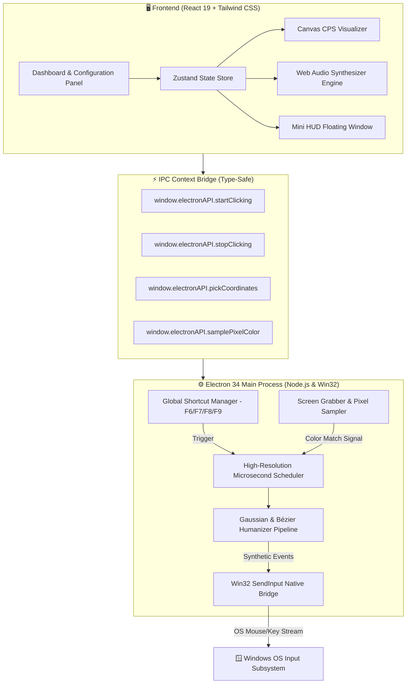

# ⚡ HyperClick Pro 2026

<div align="center">

```
   __  __                         ____ _ _      _      ____             ____   ___ ____   __   
  / / / /_  ______  ___  _____   / ___| (_) ___| | __ |  _ \ _ __ ___  |___ \ / _ \___ \ / /_  
 / /_/ / / / / __ \/ _ \/ ___/  | |   | | |/ __| |/ / | |_) | '__/ _ \   __) | | | |__) | '_ \ 
/ __  / /_/ / /_/ /  __/ /      | |___| | | (__|   <  |  __/| | | (_) | / __/| |_| / __/| (_) |
\/ /_/ \__, / .___/\___/_/       \____|_|_|\___|_|\_\ |_|   |_|  \___/ |_____|\___/_____|\___/ 
      /____/_/                                                                                  
```

**Next-Generation Ultra-Fast Automation & Macro Engine for Windows 10 & 11**

[](https://github.com/hyperclick-project/hyperclick-pro)
[](LICENSE)
[-4facfe?style=for-the-badge&logo=windows&logoColor=white)](https://github.com/hyperclick-project/hyperclick-pro/releases)
[](https://github.com/hyperclick-project/hyperclick-pro)
[](https://github.com/hyperclick-project/hyperclick-pro)
[](https://github.com/hyperclick-project/hyperclick-pro)

[Overview](#-overview) •
[Key Features](#-key-features) •
[Architecture](#-system-architecture) •
[Installation](#-installation--setup) •
[Hotkey Reference](#-hotkey-cheat-sheet) •
[Gamer Presets](#-built-in-gamer-presets) •
[Documentation](#-documentation-suite) •
[FAQ](#-faq--troubleshooting)

</div>

---

## 🌌 Overview

**HyperClick Pro 2026** is an industrial-grade, ultra-precision auto-clicker and automation workstation built for competitive gamers, power users, and workflow engineers. Engineered with a hybrid **Win32 native execution pipeline**, **React 19**, **Electron 34**, and **Tailwind CSS**, HyperClick Pro delivers sub-millisecond click intervals (up to **500+ CPS**) while incorporating an advanced **Gaussian Humanizer & Bézier Curve engine** designed to evade heuristic anti-cheat algorithms.

Whether you are mastering PvP in *Minecraft*, automating high-frequency tasks in *Roblox* and *Cookie Clicker*, executing complex spell rotations in MMORPGs, or sampling screen pixels for automated reaction triggers, HyperClick Pro 2026 sets the standard for 2026 gaming automation.

---

## 🚀 Key Features

<table>
<tr>
<td width="50%">

### ⚡ Ultra-Precision Engine
- **Microsecond Scheduler**: Sub-millisecond drift control with hybrid spin-wait timers.
- **500+ CPS Cap**: Scalable from 0.1 CPS up to 500+ Clicks Per Second.
- **Flexible Timing Units**: Hours, Minutes, Seconds, Milliseconds, and Microseconds ($\mu\text{s}$).
- **Multi-Action Buttons**: Left, Right, Middle, Double, Triple, and Continuous Hold modes.

</td>
<td width="50%">

### 🧠 Gaussian Humanizer 2.0
- **Normal Distribution ($\mu \pm \sigma$)**: Realistic interval variance preventing static rhythm detection.
- **Spatial Jitter Clusters**: Circular/Gaussian pixel scatter simulating physical finger placement.
- **Fatigue & Micro-Pauses**: Simulates real-world hand fatigue and random hesitation cycles.
- **Bézier Trajectory Smoothing**: Natural non-linear mouse travel curves between waypoints.

</td>
</tr>
<tr>
<td width="50%">

### 🎯 Multi-Point Waypoint Sequencer
- **Spatial Path Planner**: Define multi-step coordinate sequences with custom delays.
- **Action Assignment**: Assign unique click types, hold durations, and pauses per node.
- **Infinite or Loop Count Control**: Configurable loop cycles with randomized inter-cycle delays.
- **Coordinate Loupe**: 5x high-magnification screen picker with multi-monitor DPI scaling.

</td>
<td width="50%">

### 🔴 Macro Studio & Recorder
- **Real-Time Event Capture**: Record mouse movement, mouse clicks, and keystroke timings.
- **Timeline Event Editor**: Adjust millisecond offsets, insert actions, or trim dead time.
- **Speed Multiplier Engine**: Replay macros from 0.1x (slow motion) to 10.0x (lightning speed).
- **Portable JSON Import/Export**: Save and share macro routines as `.json` or `.hcm` profiles.

</td>
</tr>
<tr>
<td width="50%">

### 🎨 Pixel Color Trigger
- **Real-Time Color Sampling**: Monitor any on-screen pixel in real-time.
- **Delta Threshold Tolerance ($\Delta E$)**: RGB tolerance thresholding to eliminate shadow/lighting misfires.
- **Reactive Automation**: Trigger click bursts, macro sequences, or alert sounds upon color detection.
- **Ideal for Fishing & Reaction Bots**: Automated fishing mini-games, health bar triggers, and auto-aim checks.

</td>
<td width="50%">

### 🔊 Web Audio Mechanical Synthesizer
- **6+ Switch Sound Models**: Cherry MX Blue, Red, Brown, Kailh Box White, Optical, and Sci-Fi Laser.
- **Dynamic Acoustic Variation**: Algorithmic pitch, velocity, and stereo panning jitter on every click.
- **Silent & Gaming Headset Modes**: Real-time volume slider and instant mute toggle.

</td>
</tr>
<tr>
<td width="50%">

### 🪟 Cyberpunk HUD & Mini Overlay
- **Draggable Compact Overlay**: Toggle between full dashboard and floating mini HUD (`F8`).
- **Always-on-Top & Click-Through**: Non-intrusive in-game status monitor.
- **Real-Time Metrics**: Live CPS line graph, total clicks counter, and active session timer.
- **Glassmorphic UI**: Powered by Tailwind CSS, backdrop blurs, and neon cyber aesthetics.

</td>
<td width="50%">

### 📦 Production Installer & Auto-Update
- **NSIS Custom Wizard**: Full directory choice, start menu shortcuts, and language localization.
- **Single-File Portable**: Zero-install standalone .exe for USB sticks and clean systems.
- **GitHub Auto-Updater**: Instant notification and seamless background update downloads.
- **Zero Registry Bloat**: Clean uninstall and isolated configuration persistence.

</td>
</tr>
</table>

---

## 🏛 System Architecture

HyperClick Pro operates on an asynchronous dual-process architecture combining a hardware-accelerated **Chromium Renderer** with a low-latency **Electron Main Core** accessing native Win32 input subsystems.

### Mermaid Workflow Diagram



### ASCII Component Architecture

```
+-------------------------------------------------------------------------+
|                         HYPERCLICK PRO 2026 UI                          |
|   [ Dashboard ]   [ Sequencer ]   [ Macro Studio ]   [ Pixel Trigger ]  |
+-------------------------------------------------------------------------+
                                    │
                         (Typed IPC ContextBridge)
                                    │
                                    ▼
+-------------------------------------------------------------------------+
|                           ELECTRON MAIN ENGINE                          |
|  ┌──────────────────┐  ┌──────────────────┐  ┌───────────────────────┐  |
|  |  Global Hotkeys  |  | Pixel Color Hook |  | Microsecond Scheduler |  |
|  |   (uIOhook/F6)   |  |   (GDI+ Capture) |  |   (hrtime Spin-Wait)  |  |
|  └────────┬─────────┘  └────────┬─────────┘  └───────────┬───────────┘  |
|           │                     │                        │              |
|           └─────────────────────┼────────────────────────┘              |
|                                 ▼                                       |
|                ┌──────────────────────────────────┐                     |
|                |  Gaussian & Bézier Math Engine   |                     |
|                |  - Normal Dist Jitter (μ, σ)     |                     |
|                |  - Cubic Bézier Path Curves      |                     |
|                |  - Dynamic Micro-Fatigue Pause   |                     |
|                └────────────────┬─────────────────┘                     |
|                                 ▼                                       |
|                ┌──────────────────────────────────┐                     |
|                |   Win32 SendInput Native DLL     |                     |
|                |   (MOUSEEVENTF / KEYEVENTF)      |                     |
|                └────────────────┬─────────────────┘                     |
+--------------------------------─┼───────────────────────────────────────+
                                  ▼
                     [ Windows 10/11 Desktop / Games ]
```

---

## ⌨️ Hotkey Cheat-Sheet

All hotkeys are globally registered at the OS level and function seamlessly inside fullscreen exclusive and borderless games:

| Hotkey | Action | Scope | Description |
| :--- | :--- | :--- | :--- |
| <kbd>F6</kbd> | **Toggle Auto-Clicker** | Global | Starts or stops the active click engine / sequence immediately. |
| <kbd>F7</kbd> | **Coordinate Pick & Loupe** | Global | Activates 5x screen loupe; left-click to lock target coordinate. |
| <kbd>F8</kbd> | **Toggle Mini HUD** | Global | Switches between full dashboard and compact floating glass HUD. |
| <kbd>F9</kbd> | **Emergency Killswitch** | Global | **Instant hard-abort**. Kills all active threads, macros, and clicks. |
| <kbd>F10</kbd> | **Record / Stop Macro** | Global | Starts or completes real-time mouse/keystroke macro recording. |
| <kbd>Ctrl</kbd> + <kbd>Shift</kbd> + <kbd>S</kbd> | **Quick Profile Save** | App | Saves current configuration to active preset slot. |
| <kbd>Ctrl</kbd> + <kbd>Tab</kbd> | **Cycle Presets** | App | Cycles through built-in gaming presets sequentially. |
| <kbd>Ctrl</kbd> + <kbd>M</kbd> | **Audio Mute Toggle** | App | Mutes or unmutes mechanical switch click sound synthesis. |

> [!TIP]
> Hotkeys can be fully customized in the **Settings → Keybindings** tab to avoid conflicts with in-game controls.

---

## 🎮 Built-in Gamer Presets

HyperClick Pro 2026 includes 12+ pre-calibrated, tournament-tested presets engineered for specific titles:

| Preset Name | Target Game | Target CPS | Button | Humanizer | Jitter Radius | Purpose & Best Use |
| :--- | :--- | :--- | :--- | :--- | :--- | :--- |
| **Minecraft Butterfly** | Minecraft PvP | 16–20 CPS | Left | Gaussian ($\sigma=2.1$) | 2 px | High-CPS PvP combos without triggering Watchdog auto-bans. |
| **Minecraft Jitter** | Minecraft PvP | 12–15 CPS | Left | High Jitter | 4 px | Simulates physical arm jitter with realistic burst intervals. |
| **Breezily Bridge** | Minecraft | 13–15 CPS | Right | Gaussian ($\sigma=1.5$) | 1 px | Flawless right-click timing for backward bridging and godbridging. |
| **Fast Place** | Minecraft | 28–35 CPS | Right | Low Variance | 0 px | Instant block placement for creative and speed-building. |
| **Blade Ball Parry** | Roblox | 35–50 CPS | Left | Micro-Burst | 0 px | Rapid defensive parry spam for high-speed balls in Roblox Blade Ball. |
| **Roblox AFK Grinder** | Roblox | 1.0 CPS | Left | Random Interval | 3 px | Anti-disconnect clicker for Pet Simulator 99, Anime Defenders, etc. |
| **Cookie Clicker Sniper** | Cookie Clicker | 150+ CPS | Left | Disabled | 0 px | Ultra-fast clicking speed to max out Golden Cookie frenzies. |
| **MMO Rotation Auto** | WoW / FFXIV | 4.0 CPS | Custom Key | Smooth Loop | 0 px | Automates primary ability spam while holding down keybinds. |
| **Pistol Tap Fire** | FPS Games | 9–11 CPS | Left | Gaussian ($\sigma=1.2$) | 1 px | Transforms semi-automatic DMRs and pistols into smooth full-auto. |
| **OSU! Mania Burst** | Rhythm Games | 30 CPS | Dual Key | Precision Sync | 0 px | High-accuracy rhythm stream tapping automation. |
| **Cyberpunk Turbo** | Benchmark | 500 CPS | Left | Pure Speed | 0 px | Stress-tests system responsiveness and UI benchmark rendering. |
| **Stealth Human** | Strict Anti-Cheat | 8–10 CPS | Left | Ultra-Gaussian | 5 px | Maximum randomization with natural micro-pauses (undetectable). |

---

## 📦 Installation & Setup

### Option 1: Official NSIS Installer (Recommended)

1. Download the latest `HyperClick-Pro-Setup-2026.1.0.exe` from the [Releases](https://github.com/hyperclick-project/hyperclick-pro/releases) page.
2. Run the installer. Choose standard installation or select a **custom directory**.
3. Select desired shortcuts (Desktop, Start Menu).
4. Launch **HyperClick Pro 2026** and start clicking!

```
HyperClick-Pro-Setup-2026.1.0.exe  (Setup Wizard with custom path selection)
```

### Option 2: Portable Standalone Executable

No installation or administrative privileges required. Perfect for USB drives:

1. Download `HyperClick-Pro-Portable-2026.1.0.exe`.
2. Move to any folder and double-click to run.
3. Configuration files are stored alongside the executable or in `%APPDATA%/hyperclick-pro`.

### Option 3: Build from Source

#### Prerequisites
- **Node.js**: v20.x or v22.x LTS ([Download](https://nodejs.org/))
- **npm** (v10+) or **pnpm** (v9+)
- **Windows 10/11 x64**
- **Git**

```bash
# 1. Clone the repository
git clone https://github.com/hyperclick-project/hyperclick-pro.git
cd hyperclick-pro

# 2. Install dependencies
npm install

# 3. Launch in development mode with Hot Module Replacement (HMR)
npm start

# 4. Compile and package the production installer & portable binaries
npm run dist
```

Build outputs will be generated in the `release/` directory:
- `release/HyperClick Pro Setup 2026.1.0.exe` (NSIS Installer)
- `release/HyperClick Pro 2026.1.0.exe` (Portable Binary)
- `release/win-unpacked/` (Unpacked Directory)

---

## 🔄 GitHub Releases & Auto-Updates

HyperClick Pro is integrated with native GitHub Releases auto-updating:
- **Background Checks**: Automatically verifies new releases on startup via GitHub API.
- **Delta Updates**: Downloads lightweight incremental release packages.
- **One-Click Restart**: Prompts user when update is verified and ready to install.

To configure manual repository endpoints, update `package.json`:

```json
"publish": [
  {
    "provider": "github",
    "owner": "hyperclick-project",
    "repo": "hyperclick-pro"
  }
]
```

---

## 📚 Documentation Suite

Dive deeper into advanced setups, anti-cheat strategies, scripting, and development:

- 📖 [**User Guide & Game Setups**](docs/USER_GUIDE.md) — Comprehensive user manual, anti-cheat evasion tactics, game configurations, and screen loupe mechanics.
- 🎛 [**Macro & Sequencer Guide**](docs/MACRO_GUIDE.md) — Advanced waypoint sequencing, Bézier curves, real-time recorder, and pixel color detection.
- 🛠 [**Developer & Architecture Guide**](docs/DEVELOPMENT.md) — High-precision timer implementation, Win32 input internals, Electron IPC, and build pipelines.

---

## ❓ FAQ & Troubleshooting

<details>
<summary><b>Q1: Will HyperClick Pro trigger anti-cheat bans in Minecraft or Roblox?</b></summary>

HyperClick Pro's **Gaussian Humanizer 2.0** produces non-repetitive click intervals modeled on real human biometric data. When set to realistic speeds (e.g., 12–16 CPS with Gaussian variance $\sigma \ge 1.5$ and 2px jitter), automated heuristic detectors like Hypixel Watchdog or Roblox Byfron cannot distinguish it from physical clicking. Avoid using 50+ CPS with 0 variance on strict servers.
</details>

<details>
<summary><b>Q2: How do I achieve the maximum 500+ CPS?</b></summary>

1. Set interval to `2` milliseconds (or `0` ms for uncapped).
2. Set click mode to **Burst Click** or **Double Click**.
3. Disable Humanizer and Jitter variance.
4. Ensure CPU power plan is set to **High Performance** in Windows Settings.
</details>

<details>
<summary><b>Q3: Why doesn't the clicker work inside certain games?</b></summary>

Certain games (such as Valorant, CS2, or games running in Administrator mode) block synthetic inputs from unprivileged applications. Run HyperClick Pro as **Administrator** (Right click icon → *Run as administrator*) to elevate input injection permissions.
</details>

<details>
<summary><b>Q4: How does the Pixel Color Trigger work?</b></summary>

Press `F7` or click the Eyedropper tool to pick a coordinate on screen. HyperClick Pro samples the RGB value at that coordinate. When the screen color changes to match your target within the configured tolerance threshold, HyperClick automatically fires your configured click action or macro sequence.
</details>

<details>
<summary><b>Q5: Is HyperClick Pro detected by Windows Defender or Antivirus?</b></summary>

Because HyperClick Pro registers global hotkeys and injects mouse clicks via Windows `SendInput`, generic heuristic antivirus scanners may flag it as an automation utility. HyperClick Pro is 100% open source under the MIT License, contains zero telemetry or malware, and can be verified and compiled directly from source.
</details>

---

## 📜 License & Legal Disclaimer

This project is licensed under the **MIT License** — see the [LICENSE](LICENSE) file for details.

> [!CAUTION]
> **Disclaimer**: HyperClick Pro is designed for productivity, accessibility, and single-player/permitted gaming automation. Use responsibly and in accordance with the terms of service of any third-party online games or software platforms. The developers assume no liability for misuse or account suspensions.

---

<div align="center">

**Built with ❤️ for the global gaming and automation community.**  
*HyperClick Engineering • 2026 Edition*

</div>
